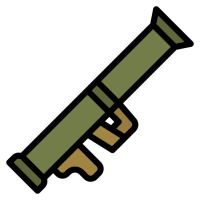

## Compatibility

Tested on Spigot-1.21.5.

## Introduction

Make bazookas from fireworks joined with TNTs, end crystals, nether stars, and spawn eggs.

## Features

Synergies perfectly with [CustomNukes](https://github.com/uprial/customnukes/) plugin

Make a bazooka:

Fire the bazooka:

## Commands

`custombazookas reload` - reload config from disk

## Permissions

* Access to 'reload' command:
`custombazookas.reload` (default: op)

## Configuration
[Default configuration file](src/main/resources/config.yml)

## Author
I will be happy to add some features or fix bugs. My mail: uprial@gmail.com.

## Useful links
* [Project on GitHub](https://github.com/uprial/custombazookas/)
* [Project on Bukkit Dev](https://www.spigotmc.org/resources/custombazookas.124997/)
* [Project on Spigot](https://legacy.curseforge.com/minecraft/bukkit-plugins/custombazookas)

## Related projects
* CustomCreatures: [Bukkit Dev](http://dev.bukkit.org/bukkit-plugins/customcreatures/), [GitHub](https://github.com/uprial/customcreatures), [Spigot](https://www.spigotmc.org/resources/customcreatures.68711/)
* CustomNukes: [Bukkit Dev](http://dev.bukkit.org/bukkit-plugins/customnukes/), [GitHub](https://github.com/uprial/customnukes), [Spigot](https://www.spigotmc.org/resources/customnukes.68710/)
* CustomRecipes: [Bukkit Dev](https://dev.bukkit.org/projects/custom-recipes), [GitHub](https://github.com/uprial/customrecipes/), [Spigot](https://www.spigotmc.org/resources/customrecipes.89435/)
* CustomVillage: [Bukkit Dev](http://dev.bukkit.org/bukkit-plugins/customvillage/), [GitHub](https://github.com/uprial/customvillage/), [Spigot](https://www.spigotmc.org/resources/customvillage.69170/)
* MasochisticSurvival: [Bukkit Dev](https://legacy.curseforge.com/minecraft/bukkit-plugins/masochisticsurvival/), [GitHub](https://github.com/uprial/masochisticsurvival/), [Spigot](https://www.spigotmc.org/resources/masochisticsurvival.124943/)
* TakeAim: [Bukkit Dev](https://dev.bukkit.org/projects/takeaim), [GitHub](https://github.com/uprial/takeaim), [Spigot](https://www.spigotmc.org/resources/takeaim.68713/)
